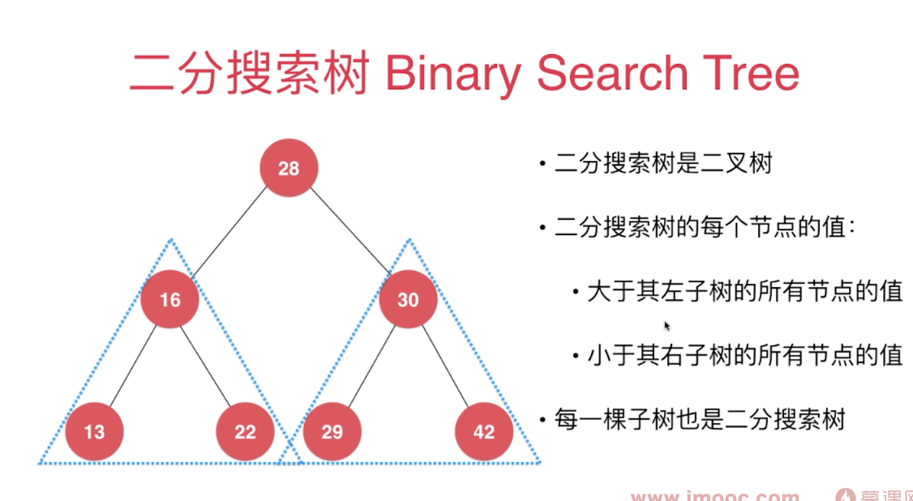
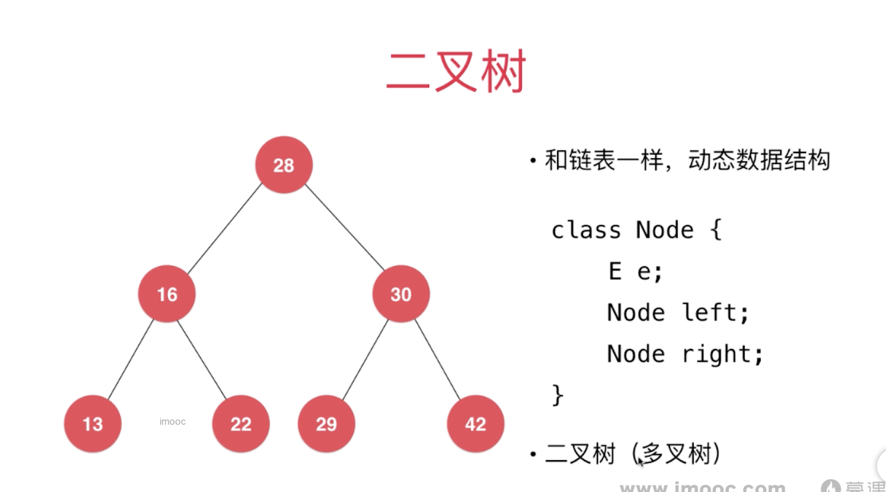
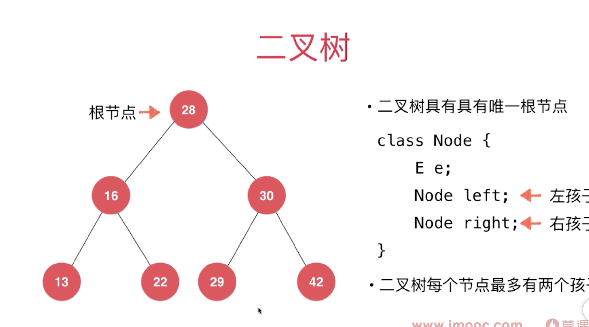
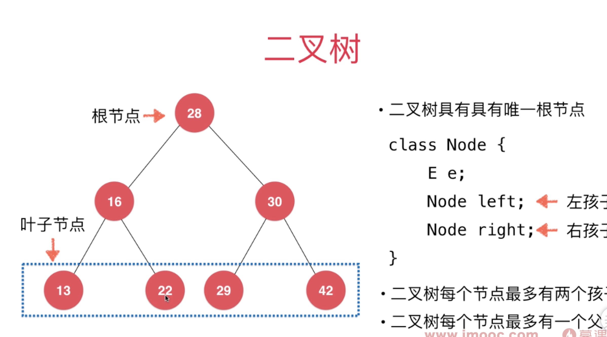

### 树的基本概念

树是一种非常有用的数据结构，数据库的实现大部分都是基于树结构的，比如在一种特殊的树结构“红黑树”中，寻找任意元素的复杂度仅仅
只需要log(N)。树是一种由节点组成的数据结构，但它比链表更加高级，在链表中，一个节点连接着另一个节点，树也是由许多的节点构成的，
唯一的区别就是一个树节点可以连接多个树节点，一颗树只有一个根节点，根节点作为起源，由它展开一个树状的数据结构。

### 二分搜索树

