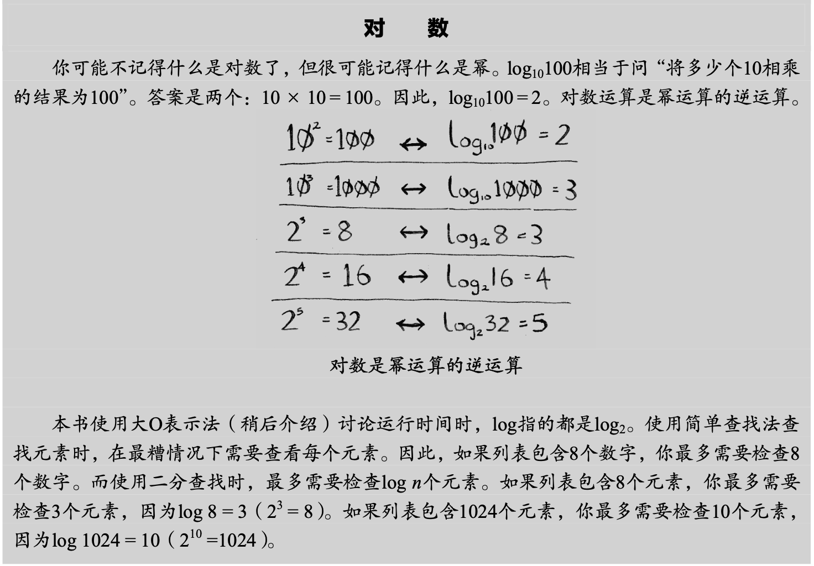

### 如何理解log(2^n)

我们从一个通俗例子来看，假设你要在字典中查找一个单词，而该字典包含240000个单词，你认为每种查找最多需要多少步？
如果我要查找的单词位于字典末尾，使用简单的查找将需要240000步。使用二分查找时，每次排除一半单词，直到最后只剩一个单词。

因此,使用二分查找只需要18步。一般而言，对于包含n个元素的列表，用二分查找最多需要log2^n步,而简单查找需要n步。

### 如何理解对数：

### 计算二叉树的高度

表达式 log2^(n+1) - 1 表示以2为底，(n+1) 的对数减去1。这个表达式可以被解读为一个计算二叉树的高度的方式，其中 n 表示二叉树的节点数量。

具体来说，log2^(n+1) 表示以2为底，(n+1) 的对数。这个部分计算的是以2为底的对数，表示将 (n+1) 分解成多少个2的幂次方的乘积，也就是将 (n+1) 分解成多少层二叉树。

然后，减去1 的操作是由于二叉树的高度是从0开始计算的，而不是从1开始。所以减去1就是将计算的层数减去1，得到二叉树的高度。

总的来说，log2^(n+1) - 1 可以理解为计算以2为底的 (n+1) 的对数，并减去1，从而得到二叉树的高度。这个公式常用于分析二叉树的性质和算法复杂度的估计。

