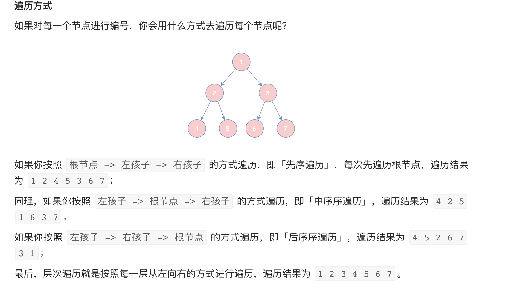
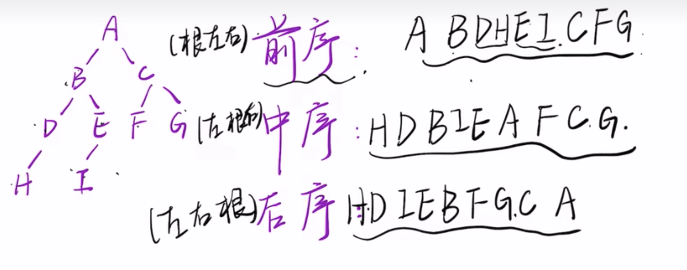
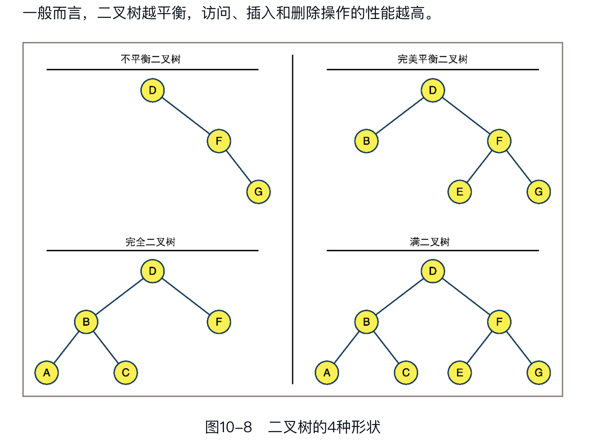
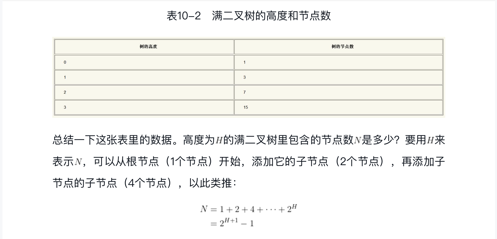

### 树的基本概念

树是一种非常有用的数据结构，数据库的实现大部分都是基于树结构的，比如在一种特殊的树结构“红黑树”中，寻找任意元素的复杂度仅仅
只需要log(N)。树是一种由节点组成的数据结构，但它比链表更加高级，在链表中，一个节点连接着另一个节点，树也是由许多的节点构成的，
唯一的区别就是一个树节点可以连接多个树节点，一颗树只有一个根节点，根节点作为起源，由它展开一个树状的数据结构。


### 二分搜索树


### 树的遍历

不像数组，在树中我们无法随时获取任意节点，遍历树总是从根节点开始，以下我们就来实现常见的三种遍历树的方式：

- 前序遍历（先序遍历）
- 中序遍历
- 后续遍历



在前序遍历中，先访问节点自己，然后访问左子树，最后再访问右子树，对于每个节点迭代此操作：

```aidl
public static void preOrderTraversal(TreeNode root) {
    if(root == null) {
        return;
    }
    System.out.println(root.value);
    preOrderTraversal(root.left);
    preOrderTraversal(root.right);
}

```

在中序遍历中，先访问左子树上的节点，再访问自己，最后再访问右子树上的节点：

```aidl
public static void inOrderTraversal(TreeNode root) {
    if(root == null) {
        return;
    }
    inOrderTraversal(root.left);
    System.out.println(root.value);
    inOrderTraversal(root.right);
}
```

在后序遍历中，先访问左右子树，最后再访问自己：

```aidl
public static void postOrderTraversal(TreeNode root) {
    if(root == null) {
        return;
    }
    postOrderTraversal(root.left);
    postOrderTraversal(root.right);
    System.out.println(root.value);
}
```

如果上面还不好理解，我们可以参考下图的记忆方式



### 二叉树形状




### 二叉树高度与节点数




